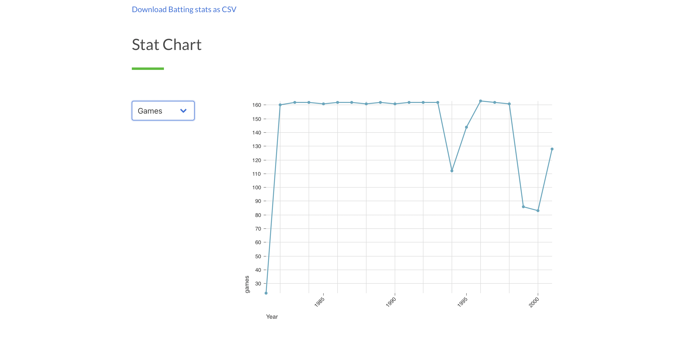

# QuickStats

**Available live at**: https://elastic-mlb-stats.vercel.app

Quickly search through decades of Major League Baseball statistics using Elasticsearch. Initial data dump provided by [Lahman's Baseball Database](http://www.seanlahman.com/baseball-archive/statistics/).

|          Batting Statistics           |            Graph any stat             |
| :-----------------------------------: | :-----------------------------------: |
|  |  |

QuickStats is a Next.js application that allows the user to search, download, and graphically view decades of Major League Baseball statistics.
