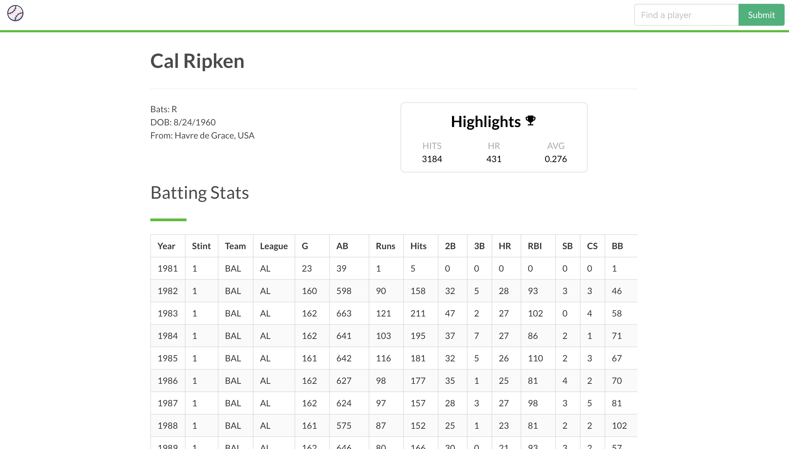

# QuickStats

QuickStats is a Next.js application that allows the user to search, download, and graphically view decades of Major League Baseball statistics. Initial data dump provided by [Lahman's Baseball Database](http://www.seanlahman.com/baseball-archive/statistics/).

**Available live at**: https://elastic-mlb-stats.vercel.app

#### Homepage

  

|          Batting Statistics           |            Graph any stat             |
| :-----------------------------------: | :-----------------------------------: |
|  |  |

### Frontend

The frontend of the application consists of custom styling created with SCSS and the [Bulma](https://bulma.io) CSS Framework. SCSS modules are used to style the React components used on the site.

### Charts

Charts displayed on the site are built with the wonderful [Nivo](https://nivo.rocks) component library.

### Search

Statistics were loaded into an Elasticsearch cluster and exposed to the application via a REST API created with AWS Lambda and API Gateway. Queries to Elasticsearch  enable accurate results relative to the input parameters. The REST API, created using the AWS CDK, is available to view in the [backend repository](https://github.com/billycastelli/MLB-Stats-cdk).

For a closer look at how the Lahman data was transformed into JSON format, see my [Lahman-To-Elasticsearch](https://github.com/billycastelli/Lahman-to-Elasticsearch) repo. 

### Deployment

Automated deployments are enabled using the [Vercel](https://vercel.com/) deployment framework.
